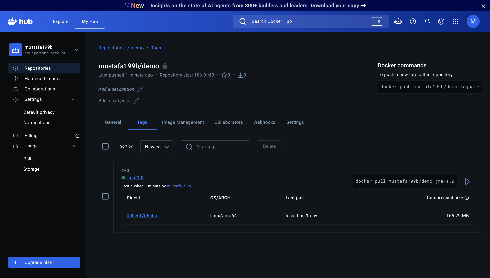
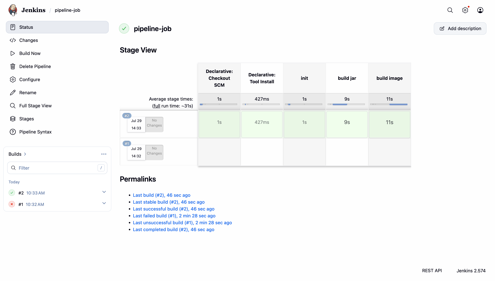

# Build Automation & CI/CD with Jenkins

This project is for the DevOps Bootcamp demo for:

Containers with Docker - [DevOps Bootcamp](https://techworld-with-nana.teachable.com/p/devops-bootcamp)

## Demo Project

- Install Jenkins on DigitalOcean
- Create a CI Pipeline with Jenkinsfile (Freestyle, Pipeline, Multi-branch Pipeline)
- Create a Jenkins Shared Library
- Configure Webhook to trigger CI Pipeline automatically on every change
- Dynamically Increment Application version in Jenkins Pipeline

### Technologies used

Jenkins, Groovy, Docker, GitLab, Git, DigitalOcean, Linux, Java, Maven

### Project Description

- Create an Ubuntu server on DigitalOcean
- Set up and run Jenkins as Docker container
- Initialize Jenkins
- Install Build Tools (Maven, Node) in Jenkins
- Make Docker available on Jenkins server
- Create Jenkins credentials for a git repository
- Create different Jenkins job types (Freestyle, Pipeline, Multi-branch pipeline) for the Java Maven project with Jenkinsfile to:
  - Connect to the application’s git repository
  - Build Jar
  - Build Docker Imaged. 
  - Push to private DockerHub repository

### Implementation

#### Install & Initialize Jenkins on DigitalOcean

In DigitalOcean, create a new droplet (Server). Install docker & pull the latest Jenkins image from docker hub

```bash
ssh root@x.x.x.x        # x.x.x.x is public server ip

apt update 
apt install -y docker.io

# pull jenkins image & run the container
docker run -d -p 8080:8080 -p 50000:50000 --name jenkins -v jenkins_home:/var/jenkins_home jenkins/jenkins
```

Navigate to the browser "http://x.x.x.x:8080" & login with the default credentials then update the password

```bash
docker volume ls

# to get volume details & mount point
docker volume inspect jenkins_home

# print the default password for login, username is admin
cat /var/lib/docker/volumes/jenkins_home/_data/secrets/initialAdminPassword
```

Once logged in successfully, Install & configure the build tools, credentials & plugins that will be used in Jenkins pipelines. Build tools can either be installed as plugins or directly on the server which can then be invoked as shell commands in the pipeline.

- Under "Settings" -> "Plugins" -> "available plugins", install "stage view" plugin (useful to see the progress of each pipeline stage)
- Under "Settings" -> "Tools" we can configure maven, gradle & nodejs as build tools to be available during run time in the pipeline
- We can also install nodejs directly on the server as an alternative with the following

```bash
docker exec -u 0 -it jenkins /bin/bash

# once inside the container, check the os distribution
cat /etc/issue

# For debian linux, use below script to download node 
curl -sL https://deb.nodesource.com/setup_20.x -o nodesource_setup.sh
bash nodesource_setup.sh
apt install -y nodejs
node -v 
npm -v
```

To use docker to build the images in the pipeline, mount docker run time from host system as a volume inside the the container

```bash
docker run -d -p 8080:8080 -p 50000:50000 --name jenkins -v jenkins_home:/var/jenkins_home -v /var/run/docker.sock:/var/run/docker.sock jenkins/jenkins
```

Install docker inside the container with the following

```bash
# -u 0 to execute bash as root user
docker exec -u 0 -it jenkins bash

# fetch & install docker 
curl https://get.docker.com/ > dockerinstall && chmod 777 dockerinstall && ./dockerinstall
```

update the permission on the socket file to give jenkins user read & write access to the socket file

```bash
docker exec -u 0 -it jenkins bash
chmod 666 /var/run/docker.sock
ls -l /var/run/docker.sock
```

Now docker can be used as a shell command in the pipeline to build docker images & push to the remote registries.

#### Create a CI Pipeline with Jenkinsfile (Freestyle, Pipeline, Multi-branch Pipeline)

CI Pipeline for a Java Maven application to build and push to the repository.

Add a new credentials in Jenkins that will be used to checkout the source code from git repository under "Setting" -> "Credentials". select, select "Username with Password" and fill the details.

##### Freestyle Job

To create a Freestyle job in Jenkins, select "Add Item" from home screen & item type "Freestyle Project". Under "Source Code Management" select "git" and fill the details for your git repository that contains the source code. Configure the credentials & branch name.

To build the Jar file, add a build step "Invoke top-level Maven targets", select the maven version installed & configured earlier in the "Tools" section, and set the "Goals" field to run the "package" command to build the project.

Create a docker file

```dockerfile
FROM amazoncorretto:17-alpine-jdk

EXPOSE 8080

COPY ./target/java-maven-app-*.jar /usr/app/
WORKDIR /usr/app

ENTRYPOINT ["java", "-jar", "java-maven-app-1.0-SNAPSHOT.jar"]
```

To build the docker image, add a new build step "Execute shell" with the following

```bash
docker build -t java-maven-app-1.0 .
```

Create a private repository in docker hub to push the image, add a new credentials of type "Username with Password" in Jenkins to connect to this repo. To bind the credentials in the pipeline, under "Environment" section, select "Use secret text(s) or file(s)" then choose "Username and password (separated)" to allow access to the credentials. Tag the image with the docker hub repo name & sign in to push the image

```bash
docker build -t <docker-hub-username>/demo:jma-1.0 .
# USERNAME & PASSWORD from docker-hub credentials 
echo $PASSWORD | docker login -u $USERNAME --password-stdin
docker push <docker-hub-username>/demo:jma-1.0
```

Run the pipeline and see that the image is now available in docker hub.



##### Pipeline Job

Create new job in Jenkins with type "Pipeline". In "Definition" section, select "Pipeline script from SCM". Configure the source code repository with the appropriate credentials & branch name.

Create Jenkins file with the following

```groovy
def gv

pipeline {   
    agent any

    tools {
        // maven installation configured in jenkins under "Settings" -> "Tools" 
        maven 'maven-3.9.16'
    }

    stages {
        stage("init") {
            steps {
                script {
                    gv = load "script.groovy"
                }
            }
        }

        stage("build jar") {
            steps {
                script {
                    gv.buildJar()

                }
            }
        }

        stage("build image") {
            steps {
                script {
                    gv.buildImage()
                }
            }
        }
} 
```

"script.groovy" file

```groovy
def buildJar() {
    echo 'building the application...'
    sh 'mvn package'
}

def buildImage() {
    echo "building the docker image..."
    
    // bind docker hub credentials to login and push the image
    withCredentials([usernamePassword(credentialsId: 'docker-hub', passwordVariable: 'PASS', usernameVariable: 'USER')]) {
        sh 'docker build -t <docker-hub-username>/demo:jma-2.0 .'
        sh 'echo $PASS | docker login -u $USER --password-stdin'
        sh 'docker push <docker-hub-username>/demo:jma-2.0'
    }
}

return this
```



##### Multibranch Job

In Jenkins, create a new Multibranch pipeline job and configure the "Branch Source" section. Under "Behaviors" select "Filter by name (with regular expression)" and set to match all the branches ".*".

Update the Jenkins file & add conditions to execute build stages based on the active branch that is being processed by the pipeline, below will build the image and deploy only from "main" branch, for other branches only the build and test stages will be executed.

```groovy
def gv

pipeline {   
    agent any

    tools {
        maven 'maven-3.9.16'
    }

    stages {
        stage("init") {
            steps {
                script {
                    gv = load "script.groovy"
                }
            }
        }

        stage("build jar") {
            steps {
                script {
                    gv.buildJar()
                }
            }
        }

        stage("test") {
            steps {
                script {
                    gv.testApp()
                }
            }
        }

        stage("build image") {
            when {
                expression { 
                    BRANCH_NAME == 'main'
                }
            }

            steps {
                script {
                    gv.buildImage()
                }
            }
        }         

        stage("deploy") {
            when {
                expression { 
                    BRANCH_NAME == 'main'
                }
            }

            steps {
                script {
                    gv.deployApp()
                }
            }
        }         
    }
} 
```

```groovy
def buildJar() {
    echo 'building the application...'
    sh 'mvn package'
}

def testApp() {
    echo 'testing the application...'
    sh 'mvn test'
}

def buildImage() {
    echo "building the docker image..."
    withCredentials([usernamePassword(credentialsId: 'docker-hub', passwordVariable: 'PASS', usernameVariable: 'USER')]) {
        sh 'docker build -t mustafa199b/demo:jma-2.0 .'
        sh 'echo $PASS | docker login -u $USER --password-stdin'
        sh 'docker push mustafa199b/demo:jma-2.0'
    }

def deployApp() {
    echo "deploying the application..."
}

return this
```

Create a new branch "multibranch-pipeline" to test the pipeline execution. 


#### 


#### 


#### 


#### 


#### 